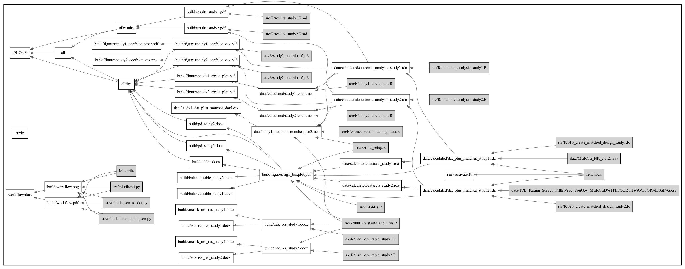

# Social Norms/Perceptions and Vaccine Intentions

This project uses a series of surveys run by YouGov to learn about the
relationship between perceptions of the vaccination intentions of others and
one's own vaccination intentions.

## Requirements

### Software

The analyses for this project were created in R version 4.1.0. You will also need
the `GLPK` system library, which you can install with

```bash
sudo apt-get install libglpk-dev  # On Debian/Ubuntu
brew install glpk                 # On MacOS
```

To install the R packages used here, run the following command after cloning the
repository.

```bash
Rscript -e 'if(!requireNamespace("remotes")){install.packages("remotes");remotes::install_github("rstudio/renv")} else {remotes::install_github("rstudio/renv")}'
```

Once these are installed, you can install most dependencies with

```bash
Rscript -e 'renv::restore()'
```

### A Note on Gurobi

This project involves the creation of a paired research design using non-bipartite
matching using the [nmatch](https://search.r-project.org/CRAN/refmans/designmatch/html/nmatch.html)
command in the `designmatch` package for R. For speed and accuracy, we follow the advice
of that package to use its interface to the [Gurobi solver](https://www.gurobi.com).
We are using the [free academic license](https://www.gurobi.com/downloads/end-user-license-agreement-academic/).
If you have trouble installing Gurobi for R, there are a few paths forward:
  * the authors of `designmatch` have some older instructions that may help debugging
    [here](https://github.com/cran/designmatch/blob/master/inst/gurobi_installation.txt)
  * if you set the environment variable `VACCINE_OPTIMIZER=GLPK` the code will attempt
    to use the `GPLK` package instead. This will likely yield slightly different answers
    than those found in our work.

Due to the proprietary nature of this software, we've not been able to include it in our
lockfile. The version we used in this analysis is 9.51 on MacOS 11. It produced
identical outcomes on both M1 and Intel based Macs. However, earlier verisons of Gurobi
do produce _slightly different_ results. If you are attempting to replicate this
project, please take note of the Gurobi version.

Feel free to raise a Github Issue or email our team if you'd like help with this or any
other aspect of reproducing our findings.

### Running the primary analysis

Once all of this is setup, then the main analysis can be run using the following
command:

```bash
make all
```

### Exploratory analysis: SPSS

Several exploratory analyses were performed using SPSS version 25. To run them, see instructions in the folder `src/SPSS`.

### Exploratory analysis: Duplicates in Python

While revising this study, we discovered several people responded to both of our
survey instruments. Ultimately, we decided to keep the first in time responses for
reasons laid out in the paper. However, if you are interested in demographic
characterisitics of duplicates across time, see
`src/notebooks/exploring_duplicates.ipynb`.

To run this analysis, we utilized [poetry] and Python 3.8.6. To install poetry, see
[their instructions](https://python-poetry.org). Once installed, you can run

```bash
poetry install               # Install dependencies
poetry run jupyter notebook  # Start jupyter to run the notebook
```

## Code layout

Our code can generally be divided into two sections:
  * Data preparation
  * Analysis
  * Supplemental code

### Data Preparation

Data preparation occurred using SPSS. Final datasets in .csv format were placed
into `data` and are used in the analysis.

Some further processing occurred in `R` to handle duplicates. This occurs in
`005_make_id_crosswalk.R` in which we subset the main data set (`MERGE_NR_2.3.21.csv`)
into first in time responses to our surveys (`deduplicated_data_first.csv`) and
last in time responses to our surveys (`deduplicated_data_last.csv`).

### Analysis

The analysis occurred using `R`. The files to produce the analyses are in `src/R`.
In general, the analysis is broken down as follows:
  * `00x`: Configuration and a bit of data preparation
  * `01x`: Study 1 matching code
  * `02x`: Study 2 matching code
  * `03x`: Outcome analysis
  * `06x`: Figure generation
  * `99x`: No longer applicable code that may be of interest
  * `*.Rmd`: Final analysis documents. Data for the paper appears here

To make the report and all associated figures (each in their own file
`src/R/figures`) do `make allfigs`.

See the `Makefile` for the dependencies between files. Also see the included figure.
Note that you can remake this figure by running `make workflowplots` though this will
require Python 3.7.1+ and graphviz to be installed.



### Supplemental code

In `src/tplutils` you'll find utilities for making the workflow plot.

In `src/notebooks` you'll find some simple summary statistics of folks who took both
of our relevant surveys.

## License

MIT
