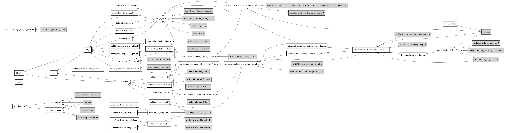

# Social Norms/Perceptions and Vaccine Intentions

This project uses a series of surveys run by YouGov to learn about the
relationship between perceptions of the vaccination intentions of others and
one's own vaccination intentions.

## Requirements

### Software

The analyses for this project were created in R version 4.1.0. You will also need
the `GLPK` system library, which you can install with

```bash
sudo apt-get install libglpk-dev  # On Debian/Ubuntu
brew install glpk                 # On MacOS
```

To install the R packages used here, run the following command after cloning the
repository.

```bash
Rscript -e 'if(!requireNamespace("remotes")){install.packages("remotes");remotes::install_github("rstudio/renv")} else {remotes::install_github("rstudio/renv")}'
```

Once these are installed, you can install most dependencies with

```bash
Rscript -e 'renv::restore()'
```

### A Note on Gurobi

This project involves the creation of a paired research design using non-bipartite
matching using the [nmatch](https://search.r-project.org/CRAN/refmans/designmatch/html/nmatch.html)
command in the `designmatch` package for R. For speed and accuracy, we follow the advice
of that package to use its interface to the [Gurobi solver](https://www.gurobi.com).
We are using the [free academic license](https://www.gurobi.com/downloads/end-user-license-agreement-academic/).
If you have trouble installing Gurobi for R, there are a few paths forward:
  * the authors of `designmatch` have some older instructions that may help debugging
    [here](https://github.com/cran/designmatch/blob/master/inst/gurobi_installation.txt)
  * if you set the environment variable `VACCINE_OPTIMIZER=GLPK` the code will attempt
    to use the `GPLK` package instead. This will likely yield slightly different answers
    than those found in our work.

Feel free to raise a Github Issue or email our team if you'd like help with this or any
other aspect of reproducing our findings.

## Code layout

Our code can generally be divided into two sections:
* Preparation of data for analysis
* Actual analysis

### Data Preparation

Data preparation occurred using SPSS. Final datasets in .csv format were placed
into `data` and are used in the analysis.

### Analysis

The analysis occurred using R. The files to produce the analyses are in `src/R`.

To make the report and all associated figures (each in their own file `src/R/figures`) do `make allfigs`.

See the `Makefile` for the dependencies between files. Also see the included figure.
Note that you can remake this figure by running `make workflowplots` though this will
require Python 3.7.1+ and graphviz to be installed.



## License

MIT
